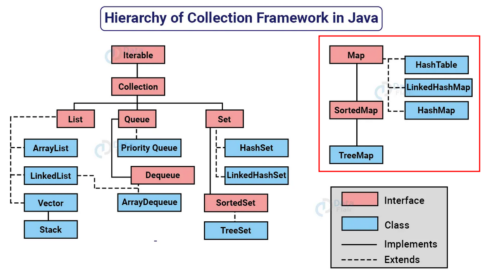

## Hierarchy of Collection Framework in Java

Durante o curso, adquiri um conhecimento profundo sobre o **Java Collections Framework**, que inclui as principais interfaces e suas implementações mais comuns. Este aprendizado foi fundamental para melhorar minha habilidade de gerenciar dados de forma eficiente em projetos de software.

### 🔍 Principais Tópicos Estudados

- **List**: Entendi como utilizar as listas em Java, que permitem a inserção de elementos duplicados e garantem a ordem de inserção. Aprendi sobre implementações como:
  - `ArrayList`
  - `LinkedList`
  - `Vector`

- **Set**: Aprendi a usar os conjuntos, que não permitem elementos duplicados. Explorei diferentes implementações, incluindo:
  - `HashSet`
  - `LinkedHashSet`
  - `TreeSet`

- **Map**: Estudei os mapas, que associam chaves a valores. Isso me permitiu entender como gerenciar coleções de pares chave-valor, utilizando implementações como:
  - `HashMap`
  - `LinkedHashMap`
  - `TreeMap`

### 🛠 Habilidades Desenvolvidas

- **Organização de Dados**: Capacidade de escolher a coleção correta para o problema, otimizando a performance e garantindo a integridade dos dados.
- **Otimização de Algoritmos**: Uso de diferentes coleções para melhorar a eficiência dos algoritmos em Java.
- **Manipulação de Estruturas de Dados**: Domínio sobre a manipulação de listas, conjuntos e mapas para gerenciar grandes volumes de dados de maneira eficiente.

### 🌟 Aplicações Práticas

Com esse conhecimento, posso criar **sistemas escaláveis e robustos**, utilizando as coleções certas para resolver problemas complexos de maneira eficiente. Este aprendizado é essencial para qualquer desenvolvedor que deseja **escrever código mais limpo, organizado e eficiente**.

---

Espero que este resumo ajude a entender a profundidade do conhecimento adquirido sobre Collections em Java. Se quiser saber mais, sinta-se à vontade para explorar os repositórios relacionados ou entrar em contato!

### 📝 Licença

Este projeto está licenciado sob a **Licença MIT**

### 📬 Contato

- ✉️ Email: [lucasperes1591@gmail.com](mailto:lucasperes1591@gmail.com)
- 🐙 GitHub: [llucashenrique](https://github.com/llucashenrique)
- 💼 LinkedIn: [Lucas Lino](https://www.linkedin.com/in/lucas-linoo/)

